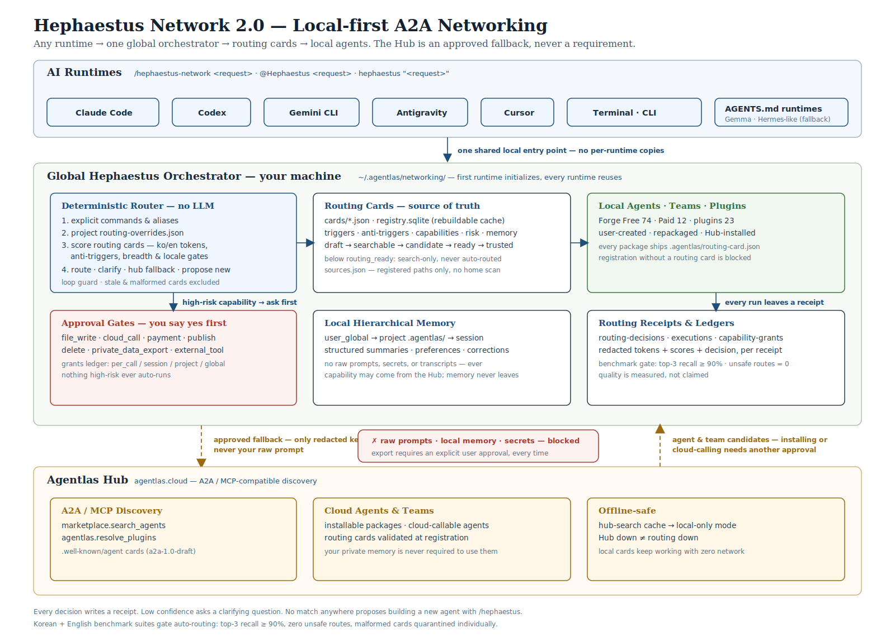
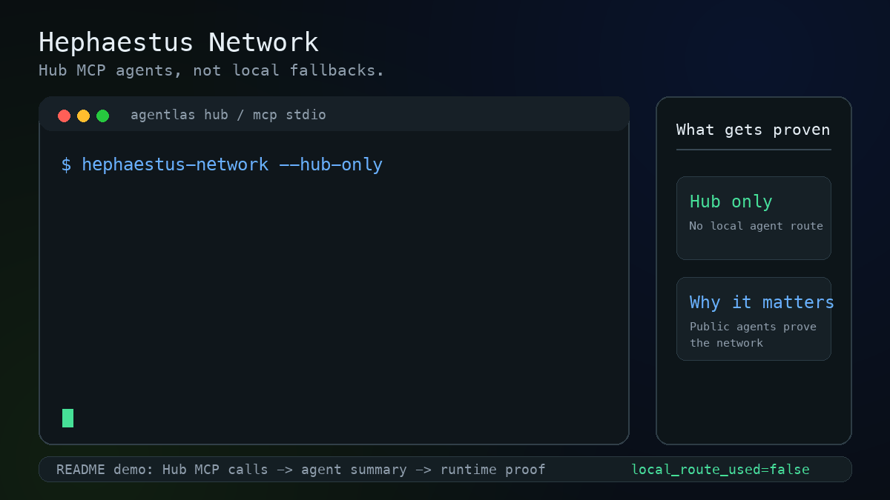
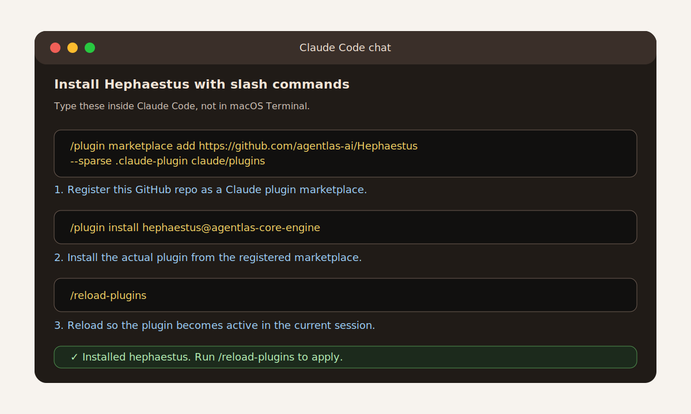
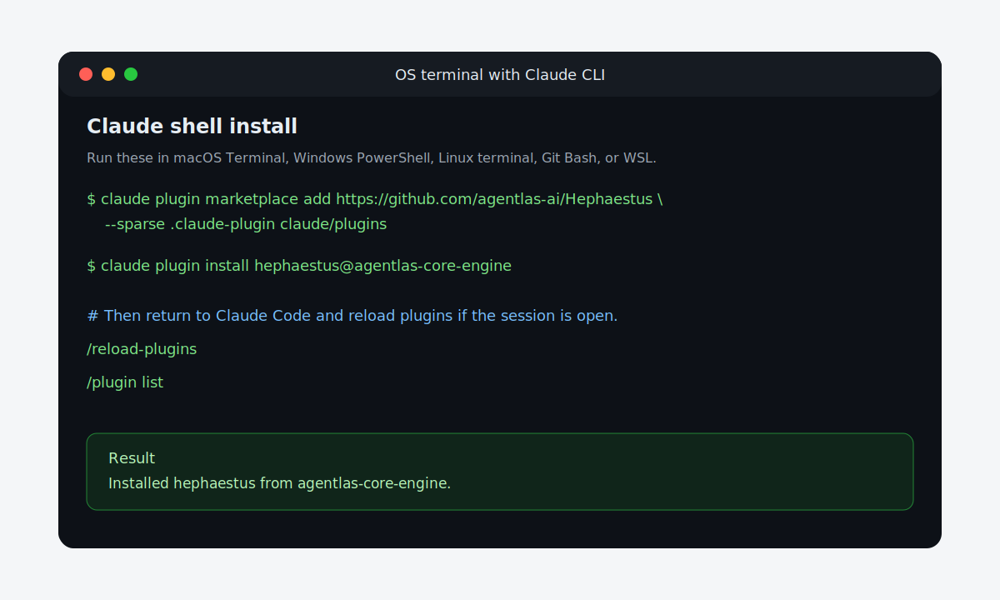
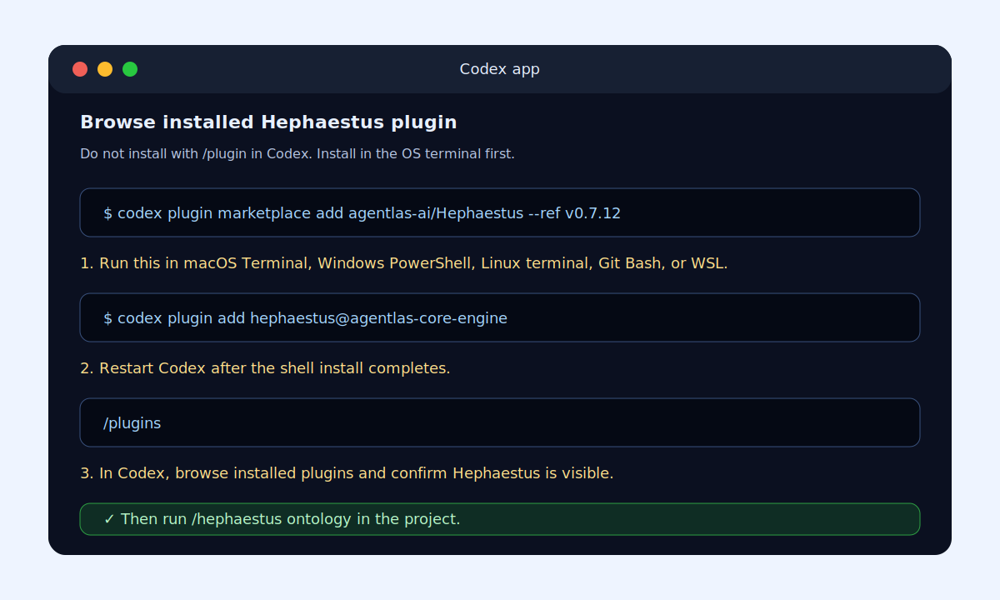
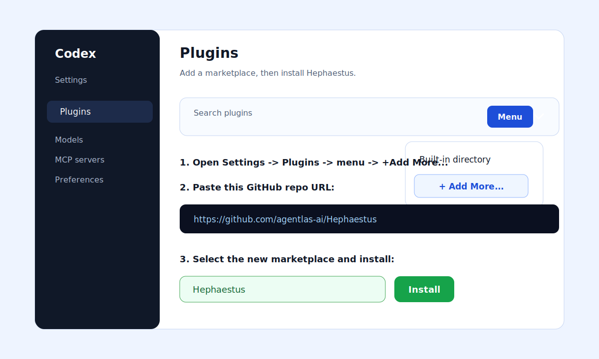
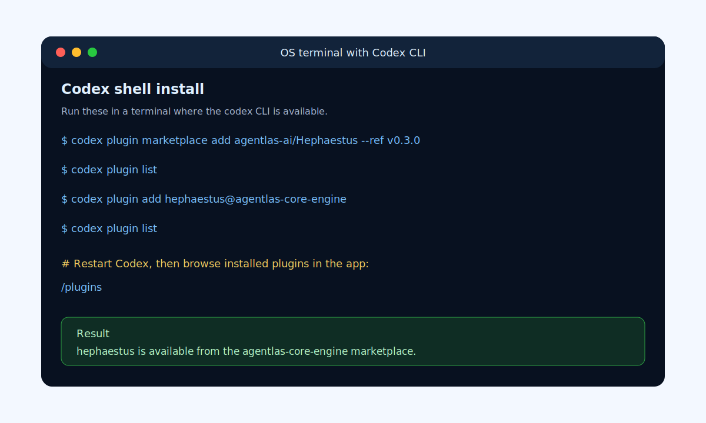

<p align="center">
  <a href="https://agentlas.cloud">
    
  </a>
</p>

<h1 align="center">Hephaestus — Agent OS</h1>

<p align="center">
  <strong>Open Agent OS for Claude Code, Codex, and Cursor: meta-agent builder, A2A Hub routing, local ontology, and governed memory/security gates.</strong>
</p>

<p align="center">
  Build developer-owned agents, route them across runtimes, give them project context, and let them evolve only through explicit memory, skill, verification, and security gates.
</p>

<p align="center">
  <a href="https://github.com/agentlas-ai/Hephaestus/releases/latest">
    
  </a>
  <a href="LICENSE">
    
  </a>
  
</p>

<p align="center">
  <a href="README.md">English</a>
  ·
  <a href="README.ko.md">한국어</a>
  ·
  <a href="README.zh-CN.md">中文</a>
  ·
  <a href="README.ja.md">日本語</a>
  ·
  <a href="README.hi.md">हिन्दी</a>
</p>

<p align="center">
  <a href="#paste-to-install-let-your-ai-do-it">Paste Install</a>
  ·
  <a href="#quickstart">Quickstart</a>
  ·
  <a href="#what-you-open-and-where-you-type">Where To Type</a>
  ·
  <a href="#visual-install-guide">Visual Install Guide</a>
  ·
  <a href="#what-it-builds">What It Builds</a>
  ·
  <a href="#architecture">Architecture</a>
  ·
  <a href="#compare">Compare</a>
  ·
  <a href="https://agentlas.cloud/desktop">Desktop</a>
</p>

<p align="center">
  
</p>

<p align="center">
  <sub>Figure 1. Request shaping, three builders, generated package contracts, memory curation, skill lifecycle, runtime adapters, and sync boundaries.</sub>
</p>

Hephaestus is the open core engine that makes Agentlas behave like an agent
operating system instead of a one-off prompt generator. It gives developers
four connected control planes:

- **Meta-agent builder.** Classify intent, ask the missing setup questions, and
  emit one agent, a multi-agent team, or a clean package with runtime adapters.
- **A2A Hub router.** Route requests through local routing cards first, then
  approved Agentlas Hub fallback, with receipts for every handoff.
- **Robust execution protocol.** Keep long-running work inside a scope lock,
  plan lock, evidence loop, review gate, and final gate so agents cannot
  silently stop or claim completion before checks pass.
- **Project ontology.** Turn approved project sources into local graph, search,
  and source-lineage context agents can query without sweeping unrelated
  folders.
- **Memory, self-evolution, and security gates.** Admit durable memory, promote
  skills, verify installs, scan packages, and block unsafe publish paths before
  agents are allowed to keep or ship new behavior.

---

## Hephaestus Network 2.0

<p align="center">
  
</p>

<p align="center">
  <sub>Figure 2. Hephaestus Network 2.0 — runtimes, the global local-first orchestrator, routing cards, local memory, and the Agentlas Hub A2A/MCP fallback.</sub>
</p>

One command, every runtime, all local:

<p align="center">
  
</p>

<p align="center">
  <sub>One prompt. Hub MCP agents only. Hephaestus shows which public agents it called, why, and what they decided.</sub>
</p>

```text
/hephaestus-network turn these meeting notes into a weekly report
/hephaestus-network draft a launch plan for my product
@Hephaestus organize and summarize this folder of documents   # runtimes without slash commands
hephaestus "find the right agent for this task"               # terminal
```

- **Routing cards.** Every agent, team, and plugin ships a standardized
  routing card (triggers, anti-triggers, capabilities, risk profile, memory
  behavior). Cards that fail the quality gates are never auto-routed.
- **Local first.** Explicit commands → project overrides → your local cards.
  The Agentlas Hub is a fallback that only ever receives redacted keywords —
  never your raw prompt.
- **Memory stays local.** Agent capability can come from the Hub; your
  user/project memory lives in `~/.agentlas/networking/` and never leaves the
  machine without an explicit export approval.
- **Receipts, not execution.** Every routing decision writes a receipt. The
  router only selects agents or Hub bundles; the host runtime enforces
  permissions when tools actually execute.
- **Measured, not claimed.** A routing benchmark (Korean + English) gates
  auto-routing: top-3 recall ≥ 90%, zero unsafe routes in the privacy suite.
- **Execution robustness evals.** A separate scorecard compares native Codex,
  Hephaestus Network routing, and the upgraded Robustness Protocol on the same
  task fixtures.

Details: [docs/hephaestus-network-2.0.md](docs/hephaestus-network-2.0.md) ·
runtime support matrix: [docs/runtime-fallback-adapters.md](docs/runtime-fallback-adapters.md) ·
robustness protocol: [docs/robustness-protocol.md](docs/robustness-protocol.md)

### Robustness Protocol

Hephaestus Robustness Protocol is a global operating protocol, not a standalone
agent or skill. It applies to native runtime work, Hephaestus Network-selected
agents, and Hub bundles:

```text
scope lock -> plan lock -> evidence loop -> review gate -> final gate
```

The first benchmark topic is **public agent repo repair** because it tests file
inspection, package contracts, schema validity, validation scripts, public
safety, and false completion in one repeatable workflow. See
[docs/robustness-eval.md](docs/robustness-eval.md), the seed tasks in
`benchmarks/robustness/`, and `scripts/score-robustness-eval.py`.

---

## Paste-to-install (let your AI do it)

New to terminals? Don't run anything yourself. Open any AI coding tool —
**Claude Code, Codex, Gemini CLI, Antigravity, or Cursor** — and paste the
message below into its chat box. The agent runs the installer for you, then
tells you the exact command to use next:

```text
Set up the Hephaestus Agentlas meta-agent in this workspace. Run
`curl -fsSL https://raw.githubusercontent.com/agentlas-ai/Hephaestus/v0.6.1/scripts/install-all-runtimes.sh | bash`
in the terminal, then tell me the exact /hephaestus command for the tool I am
using (Claude Code, Codex, Gemini CLI, Antigravity, or Cursor). If anything
fails, read the error, fix it, and retry.
```

When it finishes, type `/hephaestus` in your tool. Prefer to run the commands
yourself? Use the terminal **Quickstart** below.

---

## Quickstart

Use one of these paths on a new computer. Start with a Claude Code or Codex
plugin install unless you only want the package files copied into a normal
project folder.

### Step 0. Fresh macOS check

Claude and Codex plugin marketplace commands use `git clone`. On a fresh Mac,
`git` requires Apple's Command Line Tools. If you see
`xcode-select: note: No developer tools were found`, run this once:

```bash
xcode-select --install
```

Finish the Apple installer popup, open a new Terminal window, then verify:

```bash
git --version
```

After `git --version` works, rerun the Claude or Codex plugin install command.

### Recommended. One terminal command for all runtimes

Run this from your normal OS terminal. It installs or updates the
runtime-neutral runner (`~/.agentlas/runtime/current`), the universal
AgentSkills skill (`~/.agents/skills/hephaestus-network`), the Claude Code
plugin, Codex plugin + custom prompts + local MCP, Gemini CLI
extension/custom command, Antigravity workflow, and — when detected — Cursor,
OpenCode, OpenClaw, and Hermes Agent surfaces. It also fixes the common
`Already added from a different source` marketplace conflict by removing the
old `agentlas-core-engine` entry and adding it again from this repo.

```bash
curl -fsSL https://raw.githubusercontent.com/agentlas-ai/Hephaestus/v0.6.1/scripts/install-all-runtimes.sh | bash
```

After it finishes, restart any open AI apps. Then use:

```text
Claude Code: /reload-plugins, then /hephaestus ontology
Codex:       /prompts:hephaestus-network, or the $hephaestus-network skill
Gemini CLI:  /extensions list or /commands list, then /hephaestus
Antigravity: reopen the workspace, then /hephaestus
Cursor:      /hephaestus-network (command + skill)
OpenCode:    /hephaestus-network
OpenClaw:    /skill hephaestus-network <request>
Hermes:      hephaestus-network skill (+ MCP, hermes/README.md)
Ollama/Gemma/DeepSeek local models: docs/local-models.md
```

Use the same command again to update to the packaged ref. To force a different
ref:

```bash
curl -fsSL https://raw.githubusercontent.com/agentlas-ai/Hephaestus/main/scripts/install-all-runtimes.sh | HEPHAESTUS_REF=main bash
```

### Option A. Claude Code plugin

Open your normal OS terminal, not the Claude chat box, and run:

```bash
claude plugin marketplace add https://github.com/agentlas-ai/Hephaestus --sparse .claude-plugin claude/plugins
claude plugin install hephaestus@agentlas-core-engine
```

Then open or restart Claude Code in the project you want to work on and type:

```text
/reload-plugins
/hephaestus ontology
```

If you already installed the old `agentlas-meta-agent` plugin and Claude says
`hephaestus` is not found, refresh the marketplace and replace the old plugin:

```bash
curl -fsSL https://raw.githubusercontent.com/agentlas-ai/Hephaestus/v0.6.1/scripts/install-all-runtimes.sh | bash
```

`/hephaestus ontology` opens a local SaaS-style ontology dashboard for the
current project. The dashboard has a left navigation rail, an Obsidian-style
knowledge graph, source search, a GraphRAG query builder, a Memory Candidate
Queue, and copyable commands. It creates these files in that project only:

```text
.agentlas/ontology-inbox/
.agentlas/ontology-sources.json
.agentlas/ontology-runtime.sqlite
.agentlas/ontology-gui/index.html
```

It does not scan your home folder or sibling projects. Put approved company docs
inside `.agentlas/ontology-inbox/`, then run `/hephaestus ontology` again to
refresh the dashboard.

To create agents or teams after install:

```text
/hephaestus create a research agent for SEC filing analysis
/hephaestus create a customer support operations team
/hephaestus package this existing Claude agent into Agentlas architecture
```

Claude also supports `claude plugins ...` as an alias, but this README uses
`claude plugin ...` everywhere so the command shape stays consistent.

### Option B. Codex plugin

Open your normal OS terminal, not the Codex chat box, and run:

```bash
codex plugin marketplace add agentlas-ai/Hephaestus --ref v0.6.1
codex plugin add hephaestus@agentlas-core-engine
```

Then open or restart Codex in the project you want to work on and type:

```text
/hephaestus ontology
```

If Codex still shows `agentlas-meta-agent`, refresh the marketplace and replace
the old plugin:

```bash
curl -fsSL https://raw.githubusercontent.com/agentlas-ai/Hephaestus/v0.6.1/scripts/install-all-runtimes.sh | bash
```

The Codex OS-terminal CLI command is singular: `codex plugin`, not
`codex plugins`. Inside the Codex app, the slash command for the plugin browser
is plural: `/plugins`. After plugin install, `/hephaestus ontology` creates and
opens the same project-local dashboard with graph, sources, query, memory queue,
and command views:

```text
.agentlas/ontology-gui/index.html
To create agents or teams after install:

```text
/hephaestus create a self-evolving research agent
/hephaestus create a finance analyst team
/hephaestus package this existing Codex workspace into Agentlas architecture
```

Every generated or packaged Agentlas agent receives a global command during
creation. The final handoff must include `global_commands` for Claude Code,
Codex, Gemini CLI, generic `AGENTS.md` tools, and terminal use. For a team,
that public command routes to the orchestrator/HQ.

### Agentlas Cloud readiness

Run these local checks before uploading an existing agent to Agentlas Cloud or
publishing a clean copy to the Hub:

```bash
bin/hephaestus wizard ./some-agent --name instagram-operator
bin/hephaestus security scan ./some-agent --strict
bin/hephaestus runtime bundle ./some-agent
bin/hephaestus runtime read-agent-file ./some-agent AGENTS.md
bin/hephaestus field-test
```

The wizard creates `agentlas.json`, the scan writes
`.agentlas/security-scan.json`, and the runtime bundle uses manifest allowlists
instead of sending an entire ZIP to the model.

### Option C. Copy the files into a project

Use this if you are not installing the Claude/Codex plugin and just want the
repo package files in your current project. Open macOS Terminal, Linux terminal,
Windows Git Bash, or WSL in that project folder and run:

```bash
curl -fsSL https://raw.githubusercontent.com/agentlas-ai/Hephaestus/v0.6.1/scripts/install.sh | bash
scripts/verify-package.sh
scripts/public_safety_check.sh
```

Windows PowerShell:

```powershell
$zip = "$env:TEMP\hephaestus-v0.6.1.zip"
$extract = "$env:TEMP\hephaestus-v0.6.1"
Invoke-WebRequest "https://github.com/agentlas-ai/Hephaestus/archive/refs/tags/v0.6.1.zip" -OutFile $zip
Remove-Item $extract -Recurse -Force -ErrorAction SilentlyContinue
Expand-Archive $zip -DestinationPath $extract -Force
$src = Get-ChildItem $extract -Directory | Select-Object -First 1
Get-ChildItem $src.FullName -Force | Copy-Item -Destination (Get-Location) -Recurse -Force
```

After file install, run the ontology GUI directly:

```bash
bin/hephaestus ontology
```

### Optional Claude Code in-chat plugin install

Use this only when you are already inside Claude Code and want to install from
the Claude chat UI instead of the OS terminal.

Claude Code chat:

```text
/plugin marketplace add https://github.com/agentlas-ai/Hephaestus --sparse .claude-plugin claude/plugins
/plugin install hephaestus@agentlas-core-engine
/reload-plugins
/hephaestus ontology
```

Codex does not accept `/plugin marketplace add` inside the app. In Codex,
install from the OS terminal with `codex plugin ...`, then restart Codex and
use `/plugins` only to browse or enable installed plugins. After Hephaestus is
installed, run `/hephaestus ontology`.

If a Claude chat window does not show the new command after install, restart
Claude Code in that project.

## Visual Install Guide

Use the Claude slash-command image only when you are already inside Claude
Code. For Codex, install from the OS terminal; inside the Codex app, use
`/plugins` to browse installed plugins.

### Claude Code chat

Type these commands directly into Claude Code:



### Claude CLI from your OS terminal

Use this path when the `claude` command is available in your shell:



### Codex app plugin browser

Use this only after the OS-terminal `codex plugin ...` install:



### Codex Desktop or IDE Extension

Use this path when Codex shows a Plugins settings screen:



### Codex CLI from your OS terminal

Use this path when the `codex` command is available in your shell:



## What You Open And Where You Type

| Task | Open this | Type here |
|---|---|---|
| Download Desktop | Browser | `https://agentlas.cloud/desktop` or the OS download command |
| Install `agentlas` CLI | Agentlas Desktop | Settings -> Use from the terminal -> Install CLI |
| Run Agentlas Terminal | OS terminal | `agentlas list`, `agentlas run ...` |
| Install Claude plugin by slash command | Claude Code | `/plugin marketplace add ...`, `/plugin install ...`, `/reload-plugins` |
| Install Claude plugin by shell | OS terminal | `claude plugin marketplace add ...`, `claude plugin install ...` |
| Browse installed Codex plugins | Codex app | `/plugins` |
| Install Codex plugin by shell | OS terminal | `codex plugin marketplace add ...`, `codex plugin add ...` |

## After Install: How To Actually Use It (3 minutes)

Installation also registers the **agentlas Hub MCP** for you — Claude Code gets it
from the bundled `.mcp.json`, Codex/Antigravity from the one-touch install script,
and Gemini CLI from the extension manifest. No separate MCP setup needed.

### 1. Where do I type?

| Runtime | Open it | Then |
|---|---|---|
| Claude Code | Type `claude` in your OS terminal (or open the desktop app) | `/hephaestus`, or just plain language |
| Codex | Type `codex` in your OS terminal (or open the Codex app) | `/hephaestus` |
| Gemini CLI | Type `gemini` in your OS terminal | `/hephaestus` |
| Antigravity | Open your workspace | `/hephaestus` |

`/hephaestus` is for **building** agents. To **find and pull in** agents that already
exist, talk to the MCP in plain language as below.

### 2. MCP tools are used in plain language, not commands

You never call MCP tools directly. Just say what you want and the AI picks the
right tool.

| Say this | Tool that runs underneath |
|---|---|
| "Find an agentlas agent that helps with ASO" | `agentlas.search` |
| "What agents are on the agentlas marketplace? Show them by category" | `marketplace.search_agents` |
| "Install that team into this project" | `agentlas.get_runtime_bundle` |
| "Show my agents" (sign-in required) | `cargo.*` |

When a feature needs sign-in for the first time, Hephaestus opens the default
browser and sends the user to the Agentlas/Google sign-in screen. After that,
the signed-in state carries across Claude Code, Codex, Gemini, Antigravity, and
other Hephaestus surfaces; users do not paste or manage anything.

To verify the registration:

| Runtime | Check |
|---|---|
| Claude Code | Type `/mcp` in chat — you should see the `agentlas` server and its tools |
| Codex | `codex mcp list` in the terminal; private agent features should open browser sign-in on first use |
| Gemini CLI | `/mcp` in chat or `gemini mcp list` in the terminal |

### 3. When you don't know what agents exist

- Just ask: **"What agents are on agentlas?"**, **"Recommend agents that could help me launch my app"** — the search tools take it from there.
- Browse on the web: [agentlas.cloud/marketplace](https://agentlas.cloud/marketplace)
- Register the MCP manually in other clients (Cursor, Windsurf, VS Code, ...): [agentlas.cloud/mcp](https://agentlas.cloud/mcp)

## What It Builds

Hephaestus leaves behind a repository that another runtime can inspect, install, verify, and keep improving.

| You ask for | It routes to | You get |
|---|---|---|
| "Make one agent that does X" | `10-single-agent-builder` | One installable worker with skills, memory contracts, runtime adapters, and verification |
| "Make a team/company for this workflow" | `20-multi-agent-team-builder` | A multi-role operating team with HQ, PM Soul, Memory Curator, Policy Gate, eval, QA, and handoffs |
| "Package this existing agent/repo/workspace" | `30-agentlas-packager` | A cleaned Agentlas package for Desktop import, terminal use, Codex, Claude, Gemini, or public GitHub release |

All three modes must create `.agentlas/global-commands.json` and report the
exact global command after generation. The user should not have to infer how to
run the new agent.

Generated or repaired packages can include:

```text
AGENTS.md
CLAUDE.md
GEMINI.md
agent.md
agents/
skills/
modes/
.agentlas/
.agentlas/global-commands.json
.agents/
.claude/
.gemini/
.gemini/commands/
codex/
schemas/
templates/
scripts/verify-package.sh
scripts/public_safety_check.sh
```

## Architecture

The public core is the architecture and foldering contract. Runtime-specific folders are adapters over the same core, not separate sources of truth.

| Public contract | What it does |
|---|---|
| Mode auto-detection | Chooses `single-agent-creator`, `team-builder`, or `agentlas-packager` before generation |
| Clarify question loop | Asks only package-shaping questions that affect runtime, public boundary, tools, or safety |
| Global command registry | Adds `.agentlas/global-commands.json`, runtime command files, and the final `global_commands` handoff |
| `.agentlas` auto-activation | Lets local runtimes seed project memory, sitemap/task-bias, Memory Tickets, and vault references |
| Skill lifecycle registry | Ships candidate skill metadata, empty trial ledgers, and Curator decision ledgers before first-class recall |
| Super Ontology candidate layer | Seeds public-safe graph and memory governance files for source lineage, privacy, task coverage, causality, consensus, repair, and reflexive feedback checks |
| Production Ontology Runtime | Ingests local sources into SQLite/FTS chunks, entities, relations, GraphRAG retrieval, Memory Curator tickets, and Agent Working Memory cache |
| Ontology-backed agent overlay | Routes corpus-dependent requests (`ontology_backed: true`) so builders activate the runtime, wire a retrieval-first workflow, and set `loop_policy` per risk tier |
| Rule-based contract injection | `.agentlas/contract-injection-map.json` injects only the governance contracts matching the agent's task traits instead of all 26 |

The default export state is conservative. Generated skills are searchable candidate metadata, not automatically promoted runtime behavior. A local Curator must see execution evidence, sealed holdout or replay proof, rollback coverage, and workspace policy approval before a skill becomes first-class recall.

### Production Ontology Runtime

For knowledge-heavy personal or company agents, Hephaestus now ships a real local-first ontology runtime under `ontology/` with the executable CLI `bin/ontology`. It turns approved files into an agent-readable source archive, chunk store, full-text index, vector index, ontology graph, GraphRAG result, Memory Curator candidate ticket, and Agent Working Memory cache.

**Hephaestus Network MCP capabilities:**

- **`hephaestus_hub_invoke` MCP tool.** Hephaestus Network now has a real Hub invocation surface, not only Hub candidate search. The tool skips local routing, calls Agentlas Hub MCP (`marketplace.search_agents`, `agentlas.get_runtime_bundle`, `agentlas.resolve_plugins`), and writes execution receipts under `~/.agentlas/networking/ledgers/executions.jsonl`.
- **Hub-only local bypass.** `hub_only` routing and Hub invocation can be used with `local_inventory: []` and `reject_paid_slug: true` so local Paid/Free/plugin cards are not selected or executed.
- **Global Agentlas memory bootstrap.** Hub invocation can create the missing shared files under `~/.agentlas/` (`memory-map.json`, `project-soul-memory.md`, `invocation-ledger.jsonl`, etc.) and appends invocation evidence without storing raw prompts or secrets.
- **Installed-runtime verification.** The one-touch installer now verifies five runtime surfaces and keeps the neutral runner at `~/.agentlas/runtime/current/bin/hephaestus`.

**Ontology runtime upgrades:**

- **First-party Korean document parsing.** HWPX is parsed as ZIP/XML with paragraph and table spans, and legacy HWP5 `.hwp` is parsed directly from CFB `FileHeader` and `BodyText/Section*` streams. No GPL/AGPL parser or `hwp5txt` binary is required. Encrypted or distribution-protected HWP stays blocked with an explicit parser status.
- **CJK search works.** The tokenizer now emits character bigrams for Korean/Japanese/Chinese runs and the FTS index uses the `trigram` tokenizer, so Korean corpora (proposals, contracts, and quotes in HWPX and Office formats) are searchable with zero install. Existing databases migrate and re-index automatically on first open.
- **RRF hybrid ranking.** Full-text and vector rankings fuse via Reciprocal Rank Fusion instead of mixed-scale fixed weights, on a bounded candidate pool (no full-corpus Python scan).
- **Host-LLM search hooks (optional, zero extra cost).** A host CLI runtime (Claude Code / Codex) can inject query-expansion and rerank hooks — no embedding API or key needed. Chunks scoped private/confidential are never passed to cloud hooks; the gate is enforced inside the search pipeline.
- **Chunk overlap.** Sliding windows now overlap 15% so context is not cut at chunk boundaries.
- **Ontology-backed agent mode.** Builders can generate retrieval-first, citation-attached agents (see `modes/ontology-backed-agent.md` and the golden-path reference in `examples/ontology-proposal-agent/`), with governance contracts injected by rule and `loop_policy` (none / self-correct / verified) derived from task risk.
- **Adapter drift gate + MCP surface check.** `scripts/sync-adapters.sh --check` keeps runtime adapters byte-identical to the canonical core, and `scripts/verify-mcp-surface.sh` guards the `agentlas` MCP registration contract across Claude Code, Codex, Gemini, and Antigravity.

The Super Ontology files under `.agentlas/` remain the safety/governance layer. They define the source-lineage, privacy, task-coverage, causal, consensus, and memory-write gates around the runtime. The runtime is the implementation layer.

In Agentlas Terminal and Desktop, the same runtime is exposed as
`agentlas ontology`; in plugin-hosted tools, use `/hephaestus ontology`.
The runtime never scans your home folder or sibling projects; it only ingests
explicit approved paths, registered sources, and project-local inbox files.

Supported ingest formats:

| Format | Status |
|---|---|
| `.txt`, `.md`, `.json`, `.csv` | parsed |
| `.docx`, `.xlsx`, `.pptx` | parsed through OpenXML adapters |
| `.pdf` | parsed through `pdftotext` when installed |
| `.hwpx` | parsed through the first-party HWPX ZIP/XML adapter with paragraph and table spans |
| images/OCR | parsed through macOS Vision OCR or Tesseract when available |
| `.hwp` binary | parsed through the first-party HWP5 CFB/BodyText adapter; encrypted or distribution-protected files are blocked |
| unknown extensions | `unsupported_pending_adapter` |

The storage default is SQLite at `.agentlas/ontology-runtime.sqlite`, ignored by Git. The schema includes `sources`, `source_lineage`, `chunks`, `chunk_fts`, `entities`, `entity_aliases`, `relations`, `memory_candidates`, `memory_candidate_events`, `working_memory`, `runtime_adapters`, and `schema_migrations`.

Basic local run:

```bash
bin/ontology ingest examples/ontology-corpus --scope internal
bin/ontology query "Project Helios Memory Curator" --agent verifier
bin/ontology graph entity "Project Helios"
bin/ontology memory candidates
bin/ontology working-memory read --agent verifier
bin/ontology verify
```

The query response includes relevant chunks, related entities, relation edges, evidence refs, source spans, confidence, Memory Curator candidate suggestions, and optional Agent Working Memory writes. It is not a vector-only result.

The runtime stack is layered:

| Layer | Role |
|---|---|
| Source archive and chunk store | Stores source metadata, checksum, source type, parser status, version, privacy scope, lineage, chunks, source spans, token estimates, and checksums |
| Search index | SQLite FTS5 (trigram, CJK-capable) plus local hashing vectors with CJK bigram tokens, fused with RRF; optional host-LLM query expansion/rerank hooks; no API key is needed and source text stays local |
| Ontology graph | Stores entities, aliases, relations, confidence, evidence chunks, observed/valid time fields, source lineage, and active/stale/deprecated status |
| GraphRAG retriever | Returns text evidence and graph slices together |
| Memory Curator bridge | Creates candidate tickets only; direct durable memory writes are blocked |
| Agent Working Memory | Per-agent hot cache with task/run scope, source refs, confidence, importance, TTL, last-used time, and invalidation reason |

Memory Curator flow:

```bash
bin/ontology memory candidates
bin/ontology memory decide <ticket-id> approve --reason "Curator accepted source-backed fact"
bin/ontology memory decide <ticket-id> quarantine --reason "Needs source owner review"
```

Approval records review state but still does not write durable memory. The Memory Curator owns durable promotion. Agent Working Memory is intentionally a cache, not a source of truth.

See [`docs/ontology-runtime.md`](docs/ontology-runtime.md) for the schema, adapter behavior, storage commands, and verification coverage.

## Why Agentlas Desktop And Terminal Make It Better

Desktop and Terminal make this package useful beyond a static prompt:

- Desktop shows the agent/team structure, local projects, Apps, vault references, and runtime choices.
- Terminal runs the same package from a shell with `agentlas`.
- The built-in Core Engine Meta-Agent path means fresh Desktop/Terminal installs can create or package agents without a separate standalone plugin install.
- Standalone Claude/Codex install is still useful when you want this package directly inside those runtimes.

## Compare

| Compared with | Their strength | What Hephaestus adds |
|---|---|---|
| OpenAI / Codex | Strong models and coding terminal | Portable repo contracts, `.agentlas` memory/package files, skills, schemas, runtime adapters, and public verification |
| Claude / Claude Code | Strong reasoning and Claude-native workflows | Claude support without becoming Claude-only; Codex, Gemini, Desktop, terminal, and `AGENTS.md` stay aligned |
| OpenClaw | Local identity and workspace agent loop | Visible role folders, Agentlas package contracts, public-safety checks, Desktop import, vault references, and install surfaces |
| Hermes | Persona and memory-centered local agent runtime | PM Soul, Memory Tickets, sitemap/task-bias, policy/eval/QA, and skill lifecycle evidence as files |

OpenAI and Claude are model/runtime surfaces. OpenClaw and Hermes are local-agent experiences. Hephaestus is the package layer that makes agents portable, inspectable, installable, and publishable.

## Use It

Single agent:

```text
/meta-agent Create a research agent for SEC filing analysis.
Package it for Codex, Claude Code, Gemini, and Agentlas Desktop.
```

Multi-agent team:

```text
Use Hephaestus.
Build a customer-support operations team with PM Soul, Memory Curator, Policy Gate, QA, eval, and public-safe release checks.
```

Package an existing workspace:

```text
Package this local OpenClaw/Hermes-style workspace into Agentlas architecture.
Keep private notes, machine paths, raw logs, and secrets out of the public repo.
```

## Docs By Goal

| Goal | Start here |
|---|---|
| Understand the canonical route | [`AGENTS.md`](AGENTS.md) |
| See the full team contract | [`agent.md`](agent.md) |
| See the architecture source of truth | [`docs/source-of-truth.md`](docs/source-of-truth.md) |
| Understand runtime boundaries | [`docs/runtime-sync-boundaries.md`](docs/runtime-sync-boundaries.md) |
| Choose a mode | [`docs/mode-classifier.md`](docs/mode-classifier.md) |
| Ask the right setup questions | [`docs/clarify-question-loop.md`](docs/clarify-question-loop.md) |
| Activate local `.agentlas` workspace files | [`docs/agentlas-auto-activation.md`](docs/agentlas-auto-activation.md) |
| Review skill lifecycle promotion | [`docs/skill-lifecycle-promotion.md`](docs/skill-lifecycle-promotion.md) |
| Prepare Cloud runtime bundles | [`docs/agentlas-cloud-runtime.md`](docs/agentlas-cloud-runtime.md) |
| Run the production ontology runtime | [`docs/ontology-runtime.md`](docs/ontology-runtime.md) |
| Review Super Ontology candidate contract | [`docs/super-ontology-candidate-contract.md`](docs/super-ontology-candidate-contract.md) |
| Understand graph and Memory Curator boundaries | [`docs/super-ontology-candidate-contract.md`](docs/super-ontology-candidate-contract.md) |
| Verify ontology runtime behavior | [`scripts/verify-ontology-runtime.sh`](scripts/verify-ontology-runtime.sh) |
| Verify a package | [`scripts/verify-package.sh`](scripts/verify-package.sh) |
| Check public safety | [`scripts/public_safety_check.sh`](scripts/public_safety_check.sh) |

## Public Safety Boundary

This repo intentionally does **not** include hosted Agentlas billing/account logic, production credentials, customer data, raw private logs, raw transcripts, desktop keychain storage, local database implementation, or private deployment configuration.

Public output packages should not include local machine paths, API keys, tokens, private keys, service-account JSON, `.env` secrets, private research notes, raw chat transcripts, customer logs, hosted billing/account/OAuth internals, or desktop storage internals.

## Contributing

Before opening a PR or publishing a release, run:

```bash
scripts/verify-package.sh
scripts/verify-ontology-runtime.sh
scripts/public_safety_check.sh
```

## License

Apache-2.0. See [LICENSE](LICENSE).
