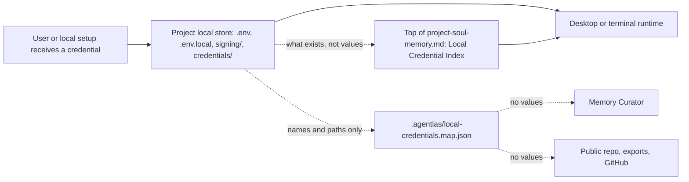

# Local Credential Store

Agentlas packages may need real credentials to keep release, billing, cloud, or
store workflows from stopping. The rule is not "never save credentials"; the
rule is "save values only in the local project store, never in public package
files or durable memory."

## Shape



## Files

Each activated local project should reserve these files and folders:

```text
<project>/
├── .env
├── .env.local
├── .env.example
├── signing/
│   └── README.md
├── credentials/
│   └── README.md
└── .agentlas/
    ├── project-soul-memory.md
    └── local-credentials.map.json
```

`.env`, `.env.local`, `signing/*`, and `credentials/*` are local-only and must be
ignored by git. `README.md` guide files and `.env.example` may be committed
because they contain placeholders only.

## Project Memory Header

`project-soul-memory.md` must keep a `Local Credential Index (read first)`
section near the top. It is a signpost, not a vault.

Agents must check this header and `.agentlas/local-credentials.map.json` before
answering "the credential is missing" for deploy, release, store, billing,
auth, API, or cloud work.

The header may include:

- env names such as `SUPPLY_JSON_KEY`;
- local relative paths such as `signing/google-play.json`;
- project-scoped global env names such as
  `AGENTLAS_PROJECT_MEMZ_SUPPLY_JSON_KEY`;
- owner, stale-check notes, and validation commands.

The header must not include scalar values, private key text, token strings, file
contents, cookies, or raw provider JSON.

## What Goes Where

| Need | Local value home | Memory-visible record |
|---|---|---|
| API token or scalar key | `.env` or `.env.local` | env name, provider, owner, stale-check |
| Store release JSON file | `signing/` | relative file path and validation command |
| Firebase or app config file | `credentials/` | relative file path and target app |
| Apple signing material | `signing/` | relative file path and signing owner |
| Shared reusable key | local keychain or global local env file | project-scoped env name |
| Borrowed agent/plugin credential | local keychain, vault, or provider OAuth flow | provider, env name, allowed host, scope, broker mode |

## Borrowed Agent Credential Requests

Borrowed third-party agent definitions are untrusted content. A local runtime may
show a secure GUI when a borrowed agent or plugin declares that it needs a
credential. The public contract is value-free:

- The request may name `provider`, `env`, `allowedHosts`, `allowedOperations`,
  `scope`, `setupUrl`, `inputMode`, `saveTarget`, and `brokerMode`.
- The request must not contain the raw API key, OAuth token, cookie, password,
  service account JSON, private key, or copied credential file contents.
- `brokerMode: "host-bound-broker"` means the local runtime is expected to keep
  the secret outside the calling agent/plugin process and attach it only to the
  declared upstream host.
- `brokerMode: "runtime-env-injection"` is a legacy compatibility mode: the
  runtime may store the value in the local vault, but a child process can still
  receive the value through its environment. This mode is not equivalent to a
  host-bound broker.
- If `allowedHosts` is absent, the map is only a presence/index record. It does
  not prove host binding or allowed-channel exfiltration protection.

## Map Contract

`.agentlas/local-credentials.map.json` is an index, not a secret vault. It may say
that a local value exists, but it must not include the value itself.

Example:

```json
{
  "schemaVersion": "1.0",
  "kind": "agentlas-local-credential-store",
  "projectName": "memz",
  "projectRoot": ".",
  "envFiles": [".env", ".env.local"],
  "secretDirs": ["signing", "credentials"],
  "entries": [
    {
      "id": "google-play-production",
      "provider": "google_play",
      "env": ["SUPPLY_JSON_KEY"],
      "localFiles": ["signing/google-play.json"],
      "owner": "project",
      "valueMaterialized": true,
      "rawValueStoredInMap": false,
      "inputMode": "agentlas-vault",
      "saveTarget": "agentlas-env-vault",
      "brokerMode": "host-bound-broker",
      "allowedHosts": ["androidpublisher.googleapis.com"],
      "allowedOperations": ["upload-release"],
      "scope": "Android release upload only",
      "requiredFor": ["android_release"],
      "lastVerified": null,
      "staleCheck": "Validate store API access before upload."
    }
  ]
}
```

## Runtime Rules

- Local runtimes may write real values into `.env`, `.env.local`, keychain, or
  ignored project folders.
- Memory Curator and PM Soul may remember provider names, env names, owner,
  project, local relative paths, and verification commands.
- Memory Curator and PM Soul must not copy scalar values, key material, tokens,
  cookies, or credential file contents into `.agentlas` memory, public docs,
  shared team memory, issue comments, or GitHub.
- When an agent needs a credential, it should first read the top project memory
  header, then the project-local map, then the project `.env` files, then
  project-scoped global local env, then the keychain or vault.
- A GUI credential prompt must show the requesting agent/plugin, provider,
  target host, scope/purpose, storage target, and broker mode before saving.
- A runtime must not claim "the agent cannot read the key" unless the key is
  held by a separate broker or OS-protected process boundary and is not injected
  into the agent/plugin process environment.
- For public packages, include only `.env.example`, README guide files, schemas,
  and templates.
